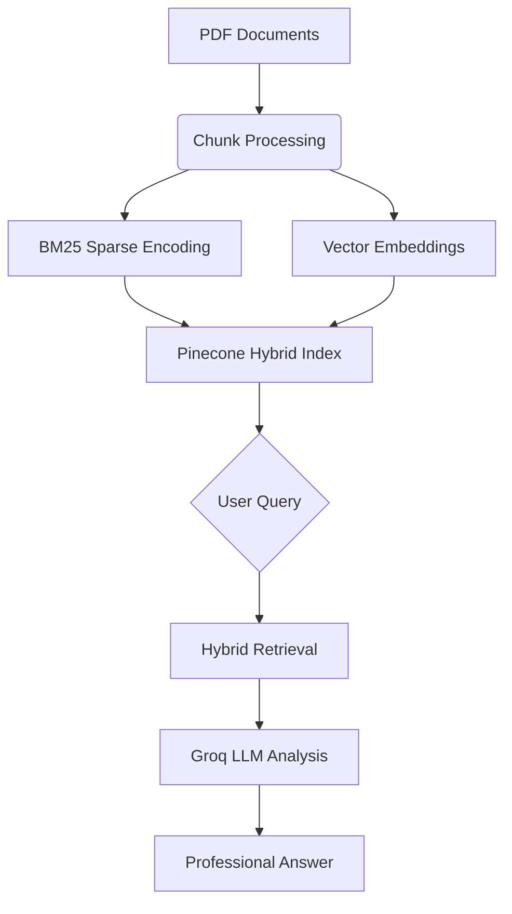

# 🧠 Enterprise DocuMind AI

**Enterprise-Grade Document Intelligence Powered by Groq & Pinecone**  
*Hybrid Semantic Search meets Ultra-Fast LLM Reasoning*

## 🌟 Features

- **📄 Multi-PDF Intelligence** - Process entire document collections with semantic understanding
- **⚡ GroqSpeed™ Inference** - Real-time responses powered by Groq's LPU & Mixtral 8x7B-32768
- **🔍 Hybrid Search Engine** - Combined BM25 + Vector search for precision and recall
- **🏗️ Enterprise-Ready Architecture** - Pinecone-managed vector database with serverless scaling
- **🎯 Context-Aware Answers** - Professional-grade responses with source attribution
- **🔧 Customizable Workflows** - Adaptable chunking, embeddings, and prompt engineering

## 🚀 Quick Start

1. **Install Dependencies**

```bash
pip install -r requirements.txt
```

2. **Configure Environment**

```bash
# .env
GROQ_API_KEY="your_groq_key"
PINE_API_KEY="your_pinecone_key"
```

3. **Launch Application**

```bash
streamlit run rag_app.py
```

## 🧩 Technical Architecture



## 🛠️ Core Technologies

- **🔮 Groq API** - 40+ tokens/ms inference with Mixtral 8x7B
- **🌲 Pinecone** - Managed vector database with hybrid search
- **🤗 Hugging Face** - all-MiniLM-L6-v2 embeddings
- **📚 LangChain** - Document processing pipelines
- **🌀 Streamlit** - Enterprise-grade UI/UX

## 📊 Workflow Overview

1. **Document Ingestion**
   - Multi-PDF parallel processing
   - Intelligent chunking (1000 chars, 200 overlap)
   - Tempfile security management

2. **Hybrid Indexing**
   - BM25 statistical encoding
   - 384-dimension vector embeddings
   - Serverless Pinecone index

3. **Query Processing**
   - Context-aware retrieval
   - Professional prompt engineering
   - Source-attributed responses

## 🎨 Interface Highlights

```python
# Professional UI Components
st.set_page_config(
    page_title="Enterprise DocuMind AI",
    page_icon="🧠",
    layout="wide",
    initial_sidebar_state="expanded"
)

# Custom CSS Features
"""
.answer-box {
    background: linear-gradient(145deg, #1e1e2f, #2d2d44);
    border-radius: 15px;
    padding: 2rem;
    box-shadow: 0 4px 30px rgba(0, 118, 255, 0.15);
}
"""
```
## 🤝 Contributing

We welcome enterprise-grade contributions:

1. Fork the repository
2. Create your feature branch (`git checkout -b feature/amazing-feature`)
3. Commit changes with semantic messages
4. Push to branch (`git push origin feature/amazing-feature`)
5. Open Pull Request

## 📜 License

MIT License - See [LICENSE](LICENSE) for details

---

**Powered by Next-Gen AI Infrastructure**  
[Groq](https://groq.com) | [Pinecone](https://pinecone.io) | [Hugging Face](https://huggingface.co)
